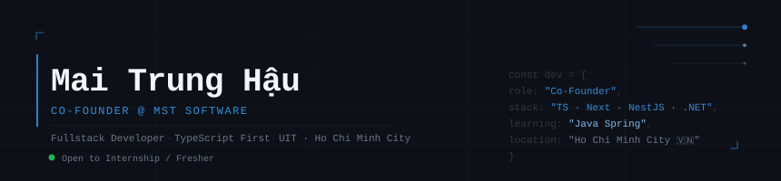

<!--
  maaitlunghau · GitHub Profile README
  ─────────────────────────────────────
  Setup checklist:
  1. Upload banner.svg to root of this repo (maaitlunghau/maaitlunghau)
  2. Run the snake GitHub Action once (see bottom of this file)
  3. Replace any placeholder links when ready
-->

<div align="center">

<picture>
  <source media="(prefers-color-scheme: dark)"  srcset="./banner.svg" />
  <source media="(prefers-color-scheme: light)" srcset="./banner.svg" />
  
</picture>

</div>

<br/>

<div align="center">

[](https://www.linkedin.com/in/marseille-hauuu-780171337/)
[](mailto:chunhau.py@gmail.com)
[](https://github.com/maaitlunghau)
[](https://github.com/maaitlunghau)
[](mailto:chunhau.py@gmail.com)

</div>

<br/>

---

## `whoami`

Full-stack web developer and Co-Founder at **MST Software**, a software company operating in the MMO (*Make Money Online*) market. Our products serve real users under real commercial pressure — live transactions, live money, live stakes.

At MST, my scope spans product direction, system architecture, feature development, and cross-team coordination. On the engineering side, I work TypeScript-first: **Next.js** on the client, **NestJS** and **.NET** on the server, **PostgreSQL** and **MongoDB** at the data layer.

Currently a third-year IT student at **UIT** (University of Information Technology, Ho Chi Minh City), specializing in Web Programming. Expanding into the **Java ecosystem** — Java Core → Spring Boot — alongside deepening my understanding of MMO business logic and systems design.

<br/>

---

## Philosophy

<div align="center">

> *"Understand the system before you touch it. Ship only what you can defend."*

</div>

<br/>

---

## MST Software — MMO Solution Technology

**Co-Founder** of a software company that builds specialized tooling for the MMO market. MMO is not a niche — it is an economy. Our products operate inside that economy: game account commerce, digital asset trading, fraud detection, and licensing infrastructure.

My role isn't limited to writing code. I participate in defining what we build, why we build it, and how it scales. Then I build it.

<br/>

**Responsibilities**

| Area | Scope |
|---|---|
| Product Direction | Define roadmap, feature scope, and tradeoffs based on market signals |
| System Architecture | Design service boundaries, data models, and integration contracts |
| Feature Development | Implement frontend, backend, and API layers end-to-end |
| Team Coordination | Sync across engineering, business, and operations via Lark + Notion |

<br/>

---

## Live Products

<table>
<tr>
<td width="50%" valign="top">

### [Shop Acc Game V2](https://shopaccgamev2.tuanori.vn/)


A game account marketplace built for Vietnam's competitive game trading market. Covers the full transaction lifecycle — listing, verification, payment, and delivery.

Designed with trust infrastructure at its core: account validation flow, secure handoff mechanics, and dispute-aware state management.

**Stack:** `PHP` `JavaScript` `MySQL`

</td>
<td width="50%" valign="top">

### [CheckScam](https://checkscam.tuanori.vn/)


An online fraud detection tool for verifying phone numbers, bank accounts, and domains against a community-reported scam database.

Built in response to the volume of online scams targeting Vietnamese internet users. Combines community data with structured lookup to surface risk signals fast.

**Stack:** `PHP` `JavaScript` `MySQL`

</td>
</tr>
</table>

<br/>

---

## Tech Stack

<div align="center">

**Frontend**

[](https://skillicons.dev)

**Backend & Database**

[](https://skillicons.dev)

**Tools & Infra**

[](https://skillicons.dev)

**Currently Learning**

[](https://skillicons.dev)

</div>

<br/>

---

## Current Focus

```
▸ Java Core  →  Spring Boot        Self-directed. Expanding beyond the TS/.NET world.
▸ MMO systems research             Business logic, trust models, and payment flows at depth.
▸ MST infrastructure               Hardening architecture for stability as the product line grows.
```

<br/>

---

## Writing

> I don't have a public blog yet — but I will. Topics I plan to cover: system design in production, TypeScript patterns, and building software for non-standard markets like MMO.
>
> When it's live, it'll be here. <!-- Replace this block with your actual blog link when ready -->

<br/>

---

## Education

| | Institution | Major | Status |
|:---:|---|---|:---:|
| 🎓 | **University of Information Technology (UIT)** — Ho Chi Minh City | Information Technology · Web Programming | Year 3 · In Progress |

<br/>

---

## GitHub Stats

<div align="center">


&nbsp;


</div>

<div align="center">


</div>

<div align="center">

[](https://github.com/ashutosh00710/github-readme-activity-graph)

</div>

<br/>

---

## Contribution Snake

<div align="center">

<picture>
  <source media="(prefers-color-scheme: dark)"  srcset="https://raw.githubusercontent.com/maaitlunghau/maaitlunghau/output/github-contribution-grid-snake-dark.svg" />
  <source media="(prefers-color-scheme: light)" srcset="https://raw.githubusercontent.com/maaitlunghau/maaitlunghau/output/github-contribution-grid-snake.svg" />
  
</picture>

<details>
<summary>⚙️ Setup snake animation</summary>
<br/>

Create `.github/workflows/snake.yml`:

```yaml
name: Generate Snake Animation

on:
  schedule:
    - cron: "0 0 * * *"
  workflow_dispatch:
  push:
    branches: [main]

jobs:
  generate:
    runs-on: ubuntu-latest
    timeout-minutes: 10
    steps:
      - name: Generate snake animation
        uses: Platane/snk/svg-only@v3
        with:
          github_user_name: ${{ github.repository_owner }}
          outputs: |
            dist/github-contribution-grid-snake.svg
            dist/github-contribution-grid-snake-dark.svg?palette=github-dark
      - name: Push to output branch
        uses: crazy-max/ghaction-github-pages@v3.1.0
        with:
          target_branch: output
          build_dir: dist
        env:
          GITHUB_TOKEN: ${{ secrets.GITHUB_TOKEN }}
```

</details>

</div>

<br/>

---

<div align="center">

**Open to internship and fresher opportunities in fullstack development.**<br/>
Reach out if what you're building is interesting.

<br/>

[](mailto:chunhau.py@gmail.com)
&nbsp;&nbsp;
[](https://www.linkedin.com/in/marseille-hauuu-780171337/)

<br/>

<sub>TypeScript · Next.js · NestJS · .NET · PostgreSQL · Ho Chi Minh City 🇻🇳</sub>

</div>